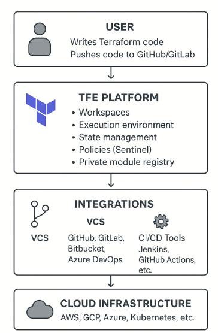

🌱 Easy Explanation of Terraform Enterprise Architecture

Terraform Enterprise is built with 4 main layers:

1. User Layer (Developers/Operators)
--> Developers write Terraform code.
-->Push code to GitHub/GitLab.

2. Application Layer (Terraform Enterprise Platform)
--> Workspaces → Separate state & runs for dev, test, prod.
--> Execution Environment → Secure containers run Terraform plan/apply.
--> State Management → Centralized, secure, locked.
--> Policies (Sentinel) → Ensure compliance (rules before apply).
--> Private Module Registry → Share reusable code inside company.

3. Integration Layer
--> VCS (GitHub, GitLab, Bitbucket, Azure DevOps) → triggers runs on code changes.
--> CI/CD Tools (Jenkins, GitHub Actions, etc.).

4. Infrastructure Layer (Cloud/On-Prem)
--> Actual infra created → AWS, GCP, Azure, Kubernetes, etc.

🌎 Interview One-Line Summary

👉 Terraform Enterprise provides a central platform where developers push Terraform code, it runs securely in workspaces with policies and approvals, manages state centrally, and then provisions infrastructure across clouds.

